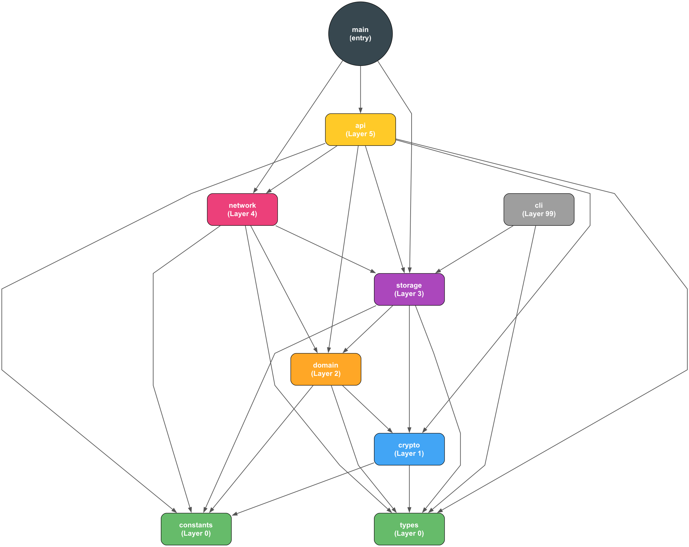

# Goud Chain

Encrypted blockchain with API key-based authentication. Store any JSON data on an immutable, distributed ledger using Proof of Authority consensus.

[](https://dev-api.goudchain.com/)
[](https://dev-dashboard.goudchain.com/)

## 🚀 Try the Live Demo

**Test the blockchain in action** - No installation required!

- **📡 API Endpoint:** [https://dev-api.goudchain.com](https://dev-api.goudchain.com)
- **🌐 Dashboard:** [https://dev-dashboard.goudchain.com](https://dev-dashboard.goudchain.com)

**Quick Test:**
```bash
# Create account and get API key
curl -X POST https://dev-api.goudchain.com/account/create \
  -H "Content-Type: application/json" \
  -d '{"metadata": null}'

# Login with API key to get session token
curl -X POST https://dev-api.goudchain.com/account/login \
  -H "Content-Type: application/json" \
  -d '{"api_key": "YOUR_API_KEY_HERE"}'

# Submit encrypted data (use session token or API key)
curl -X POST https://dev-api.goudchain.com/data/submit \
  -H "Content-Type: application/json" \
  -H "Authorization: Bearer YOUR_API_KEY" \
  -d '{"label": "test", "data": "{\"message\": \"Hello Blockchain!\"}"}'

# View the blockchain
curl https://dev-api.goudchain.com/chain
```

Or visit the [Dashboard](https://dev-dashboard.goudchain.com) to interact with the blockchain visually.

> **Note:** This is a proof-of-concept deployment running on GCP's free tier. Hosted on a 2-node network with load balancing.

## Features

### Performance & Storage
- **RocksDB Persistence** - High-performance embedded database with Snappy compression
- **Incremental Writes** - O(1) block writes (vs O(n) for full JSON serialization)
- **Fast Lookups** - O(1) block retrieval by index
- **50% Disk Space Savings** - Snappy compression reduces storage footprint
- **Automatic Migration** - Seamless JSON-to-RocksDB upgrade on first startup

### Blockchain & Consensus
- **No Mining** - Instant blocks (<1s) using Proof of Authority
- **Deterministic Validator Rotation** - Round-robin PoA consensus
- **Ed25519 Signatures** - Digital signatures for blockchain integrity
- **Merkle Trees** - Tamper detection with encrypted data and blind indexes

### Privacy & Security
- **Privacy-Preserving Architecture** - Full metadata encryption with blind indexes
- **Per-User + Per-Block Salted Blind Indexes** - Prevents cross-block correlation attacks (Phase 5)
- **Timestamp Obfuscation** - Daily granularity with random jitter (±4 hours) hides timing and timezone (Phase 5)
- **Dual-Layer Encryption** - Master key for block data, API keys for collections
- **Two-Tier HKDF Key Derivation** - OWASP-compliant security with optimized performance:
  - **Tier 1 (Authentication):** 100,000 iterations for API key hashing (brute-force resistance)
  - **Tier 2 (Encryption):** 1,000 iterations for encryption/MAC keys (domain separation)
- **API Key Authentication** - Cryptographically secure 256-bit keys
- **JWT Sessions** - Token-based authentication with 1-hour expiry
- **Request Signing** - HMAC-SHA256 signatures prevent replay attacks with 5-minute timestamp tolerance and 10-minute nonce window
- **Payload Size Limits** - 10MB per collection, 100MB per block, 100-character labels (prevents storage DoS)
- **Input Validation** - JSON schema validation with max depth limits and control character filtering (prevents injection attacks)
- **Constant-Time Comparisons** - `subtle` crate prevents timing attacks
- **Memory Protection** - Automatic key zeroization with 5-minute TTL and LRU cache
- **Graduated Rate Limiting** - 5-tier DoS protection (10 writes/sec, 100 reads/sec)
- **IP Banning** - 24-hour IP bans after 5th violation (complete blacklist)
- **Privacy-Preserving Enforcement** - IP addresses hashed before storage

### Infrastructure
- **Collection-Based Storage** - Group encrypted data by user account
- **Auto Schema Migration** - Seamless upgrades during development
- **Environment Variable Key Management** - Production-ready configuration
- **Load Balanced** - NGINX reverse proxy with health checks
- **Cloud-Native** - Runs on GCP free tier ($0/month)
- **DoS Protection** - 5-tier graduated rate limiting with IP banning

### Operational Security & Observability
- **Audit Logging** - Comprehensive audit trails stored on blockchain
  - All account and data operations logged (create, login, submit, decrypt, list)
  - Batched storage (10s intervals or 50 events) reduces blockchain bloat
  - Privacy-preserving: IP addresses hashed (truncated SHA-256)
  - Encrypted with user's API key (only account owner can view their logs)
  - Query API with time range, event type, and pagination filters
- **System Metrics** - Real-time performance monitoring via `/api/metrics` endpoint
  - Cache hit rates, operations per second, chain statistics
  - Prometheus-compatible metrics for external monitoring tools
  - Per-node health and status tracking
- **Dashboard Integration** - Visual audit log viewer with filtering and export
  - Real-time event streaming
  - Timeline visualization
  - CSV/JSON export capabilities

## Quick Start (Local Development)

```bash
./run              # Start 3-node network (production mode)
./run dev          # Start with hot reload (development mode - debug builds)
./run dev-perf     # Start with hot reload (development mode - release builds)
```

**Development Mode Comparison:**

| Mode | Build Type | Rebuild Time | Block Creation | Use Case |
|------|-----------|--------------|----------------|----------|
| `./run start` | Release | ~2-3 min | ~20-50ms | Production testing, performance benchmarks |
| `./run dev-perf` | Release | ~30-60s | ~20-50ms | Fast iteration + production performance |
| `./run dev` | Debug | ~5-10s | ~4-10s | Quick prototyping, debugging |

**🚀 Primary API Endpoint:** [http://localhost:8080](http://localhost:8080) (Load Balancer)

**🌐 Dashboard:** [http://localhost:3000](http://localhost:3000)

**📓 Jupyter Lab (dev mode only):** [http://localhost:8888](http://localhost:8888)

**📡 Individual Nodes (for debugging):**
- Node 1: http://localhost:8081
- Node 2: http://localhost:8082
- Node 3: http://localhost:8083

> **Note:** Always use the load balancer endpoint (`http://localhost:8080`) for all API calls. It provides automatic failover and intelligent routing.
>
> **Note:** Jupyter Lab is **only available in local development** (`./run dev`). It is not deployed to GCP.

## Architecture

### Local Development (3 nodes)

```
                    Developers
                        ↓
            ┌───────────────────────┐
            │  NGINX Load Balancer  │  ← Port 8080
            │  - Health checks      │
            │  - Failover           │
            │  - Request routing    │
            └───────────┬───────────┘
                        │
        ┌───────────────┼───────────────┐
        ↓               ↓               ↓
    ┌───────┐      ┌───────┐      ┌───────┐
    │ node1 │◄────►│ node2 │◄────►│ node3 │
    │ :8081 │  P2P │ :8082 │  P2P │ :8083 │
    └───────┘      └───────┘      └───────┘
```

### GCP Production (2 nodes, single VM)

```
                 Cloudflare CDN
                 (HTTPS, Port 443)
                        ↓
            dev-api.goudchain.com
            dev-dashboard.goudchain.com
                        ↓
        ┌───────────────────────────────┐
        │   GCP e2-micro VM (1GB RAM)   │
        │                               │
        │   ┌─────────────────┐         │
        │   │ NGINX (Port 80) │         │
        │   └────────┬─────────┘         │
        │            │                   │
        │    ┌───────┼───────┐           │
        │    ↓       ↓       ↓           │
        │  node1   node2  dashboard      │
        │  :8081   :8082   :3000         │
        │    ↕──P2P──↕                   │
        └───────────────────────────────┘
```

**Load Balancer Features:**
- Automatic failover to healthy nodes
- Health checks (monitors chain state and node availability)
- Intelligent routing:
  - **Read operations** (`GET /data/list`, `/chain`, `/peers`) → Round-robin
  - **Write operations** (`POST /data/submit`, `/data/decrypt`) → Least-connections
- Connection pooling for performance
- CORS support for browser access

### Data Flow

```
1. Account Creation → Generate 256-bit API Key → Hash with SHA-256 → Store on Blockchain
2. Authentication → API Key → JWT Session Token (1hr expiry)
3. Data Submission → JSON → Encrypt with API-derived key (HKDF) → HMAC → Sign (Ed25519) → Collection
4. Block Creation → Validator creates block → Encrypt with master key → Generate blind indexes → Merkle Root → Blockchain
5. Data Retrieval → Find via blind index → Decrypt block → Decrypt collection with API key → Verify HMAC → Return JSON
```

**Consensus:** Proof of Authority (PoA)
- Validators: `Validator_1`, `Validator_2`
- Deterministic round-robin rotation per block
- No mining, instant block creation

**Cryptography Architecture:**
- **Key Generation**: 256-bit random API keys (base64-encoded)
- **Key Storage**: SHA-256 hash stored on blockchain (not the key itself)
- **Key Derivation**: HKDF with 100k iterations produces:
  - Encryption key (32 bytes for AES-256)
  - MAC key (32 bytes for HMAC-SHA256)
  - Search key (32 bytes, future use)
- **Encryption**: AES-256-GCM with 12-byte random nonce
- **Integrity**: HMAC-SHA256 over encrypted payload
- **Authentication**: Constant-time comparison prevents timing attacks

**Block Structure:**
```rust
Block {
    index: u64,
    timestamp: i64,                   // Obfuscated to hourly granularity
    encrypted_block_data: String,     // All accounts + collections encrypted
    blind_indexes: Vec<String>,       // HMAC-based searchable indexes
    block_salt: String,               // Random salt per block (prevents correlation)
    validator_index: u64,             // Obfuscated validator identity
    previous_hash: String,
    merkle_root: String,              // Hash of encrypted data + blind indexes
    hash: String,
    nonce: String,                    // Encryption nonce
}
```

**User Account:**
```rust
UserAccount {
    account_id: String,           // UUID
    api_key_hash: String,         // SHA-256 hash (for verification)
    public_key: String,           // Ed25519 public key
    created_at: i64,
    metadata_encrypted: Option<String>,  // Optional encrypted metadata
    signature: String,            // Ed25519 signature
}
```

**Encrypted Collection:**
```rust
EncryptedCollection {
    collection_id: String,        // UUID
    owner_api_key_hash: String,   // Links to UserAccount
    encrypted_metadata: String,   // Encrypted label/tags
    encrypted_payload: String,    // Encrypted JSON data
    mac: String,                  // HMAC-SHA256 for integrity
    nonce: String,                // 12-byte random nonce
    signature: String,            // Ed25519 signature
    public_key: String,           // Ed25519 public key
    user_salt: String,            // Phase 5: Per-user random salt (prevents correlation)
}
```

## Rate Limiting

Goud Chain implements **graduated DoS protection** with a 5-tier penalty system to protect against abuse while preserving read access for legitimate users.

### Rate Limits

**Default (Local Development):**
- **Writes:** 10 requests/second per API key
- **Reads:** 100 requests/second per API key

**GCP Production (e2-micro):**
- **Writes:** 5 requests/second per API key
- **Reads:** 50 requests/second per API key

### Graduated Penalty System

Violations escalate through 5 tiers with increasing severity:

| Tier | Violation | Penalty | Blocks Writes? | Blocks Reads? | Duration |
|------|-----------|---------|----------------|---------------|----------|
| 1 | Warning | HTTP 200 with warning header | No | No | — |
| 2 | 1st offense | Cooldown period | No | No | 30 seconds |
| 3 | 2nd offense | Write operations blocked | Yes | No | 5 minutes |
| 4 | 3rd offense | Write operations blocked | Yes | No | 1 hour |
| 5 | 4th offense | Permanent write ban | Yes | No | Permanent |
| 6 | 5th offense | Complete blacklist + IP ban | Yes | Yes | 24 hours (IP) |

**Key Principles:**
- **Read Access Preserved:** Users can always read their data (until complete blacklist)
- **IP-Based Fallback:** If IP is blocked, read operations allowed at limited speed
- **Privacy-Preserving:** IP addresses hashed using SHA-256 before storage
- **Fail-Open Design:** If rate limiter errors, requests are allowed (availability over security)

### HTTP Headers

**Response Headers (All Requests):**
```
X-RateLimit-Limit: 10
X-RateLimit-Remaining: 7
X-RateLimit-Reset: 1704067260
```

**Warning State (Tier 1):**
```
X-RateLimit-Violation: warning
X-RateLimit-Violation-Count: 0
X-RateLimit-Cooldown: 30
```

**Blocked State (HTTP 429):**
```json
{
  "error": "API key banned (WriteBlock5Min): expires at 1704067500"
}
```

### Configuration

**Environment Variables:**
```bash
# Rate limiting configuration
RATE_LIMIT_WRITE_PER_SEC=10         # Write operations per second
RATE_LIMIT_READ_PER_SEC=100         # Read operations per second
RATE_LIMIT_BYPASS_KEYS=             # Comma-separated API keys to bypass rate limiting
RATE_LIMIT_ENABLE_IP_BAN=true       # Enable 24-hour IP bans on 5th violation
```

**Bypass Whitelist:**
For testing or trusted clients, add API keys to bypass rate limiting:
```bash
RATE_LIMIT_BYPASS_KEYS=api_key_1,api_key_2,api_key_3
```

### Storage Architecture

**RocksDB Schema:**
- `ratelimit:{api_key_hash}:{window_start}` → Request count (u32)
- `violations:{api_key_hash}` → ViolationRecord (Bincode-serialized)
- `bans:{api_key_hash}` → BanRecord (Bincode-serialized)
- `ip_bans:{ip_hash}` → Expiry timestamp (i64)

**Performance:**
- LRU cache for 10,000 hot API keys
- <500µs overhead per request
- In-memory lookups for cached keys
- RocksDB persistence for violations/bans

### Testing

See [INTEGRATION_GUIDE.md](INTEGRATION_GUIDE.md) for comprehensive testing strategy including isolated environment setup to avoid self-banning during development.

## API Reference

### Create Account

```bash
curl -X POST http://localhost:8080/account/create \
  -H "Content-Type: application/json" \
  -d '{
    "metadata": null
  }'

# Response:
{
  "account_id": "550e8400-e29b-41d4-a716-446655440000",
  "api_key": "abcd1234efgh5678ijkl9012mnop3456qrst7890uvwx1234yzab5678cdef9012",
  "warning": "IMPORTANT: Save this API key! It will only be shown once and cannot be recovered."
}
```

**⚠️ Important:** The API key is shown only once. Store it securely - it cannot be recovered.

### Login

```bash
curl -X POST http://localhost:8080/account/login \
  -H "Content-Type: application/json" \
  -d '{
    "api_key": "abcd1234efgh5678ijkl9012mnop3456qrst7890uvwx1234yzab5678cdef9012"
  }'

# Response:
{
  "session_token": "eyJhbGciOiJIUzI1NiIsInR5cCI6IkpXVCJ9...",
  "expires_in": 3600,
  "account_id": "550e8400-e29b-41d4-a716-446655440000"
}
```

**Note:** Session tokens expire after 1 hour. You can use either the API key or session token for authenticated requests.

### Submit Encrypted Data

```bash
curl -X POST http://localhost:8080/data/submit \
  -H "Content-Type: application/json" \
  -H "Authorization: Bearer YOUR_API_KEY" \
  -d '{
    "label": "my-data",
    "data": "{\"key\": \"value\"}"
  }'

# Response:
{
  "collection_id": "650e8400-e29b-41d4-a716-446655440000",
  "label": "my-data",
  "block_number": 5
}
```

**Authentication Methods:**
- Header: `Authorization: Bearer YOUR_API_KEY`
- Header: `Authorization: Bearer YOUR_SESSION_TOKEN`

### List My Collections

```bash
curl -X GET http://localhost:8080/data/list \
  -H "Authorization: Bearer YOUR_API_KEY"

# Response:
{
  "collections": [
    {
      "collection_id": "650e8400-e29b-41d4-a716-446655440000",
      "label": "my-data",
      "created_at": 1704067200,
      "block_number": 5
    }
  ]
}
```

### Decrypt Collection

```bash
curl -X POST http://localhost:8080/data/decrypt/650e8400-e29b-41d4-a716-446655440000 \
  -H "Authorization: Bearer YOUR_API_KEY"

# Response:
{
  "collection_id": "650e8400-e29b-41d4-a716-446655440000",
  "data": "{\"key\": \"value\"}"
}
```

### View Blockchain

```bash
curl http://localhost:8080/chain

# Response:
{
  "chain": [
    {
      "index": 0,
      "timestamp": 1704067200,
      "encrypted_data": [],
      "previous_hash": "0",
      "merkle_root": "e3b0c44298fc1c149afbf4c8996fb92427ae41e4649b934ca495991b7852b855",
      "hash": "abc123...",
      "validator": "Genesis"
    }
  ],
  "length": 1
}
```

### Health Check

```bash
curl http://localhost:8080/health

# Response:
{
  "status": "healthy",
  "chain_length": 1,
  "latest_block": 0,
  "node_id": "node1",
  "peer_count": 1
}
```

### System Metrics

```bash
curl http://localhost:8080/api/metrics

# Response:
{
  "node_id": "node1",
  "chain_length": 10,
  "peer_count": 2,
  "latest_block_index": 9,
  "latest_block_timestamp": 1704067200,
  "status": "healthy",
  "total_operations": 25,
  "cache_hit_rate": 99.3,
  "operations_per_second": 0.0
}
```

### Query Audit Logs

```bash
# Get all audit logs for authenticated user
curl -X GET "http://localhost:8080/api/audit?page=0&page_size=20" \
  -H "Authorization: Bearer YOUR_API_KEY"

# Filter by event type and time range
curl -X GET "http://localhost:8080/api/audit?event_type=DataSubmitted&start_ts=1704067200000&end_ts=1704153600000" \
  -H "Authorization: Bearer YOUR_API_KEY"

# Response:
{
  "logs": [
    {
      "event_type": "DataSubmitted",
      "timestamp": 1704067800000,
      "collection_id": "650e8400-e29b-41d4-a716-446655440000",
      "ip_hash": "1a2b3c4d5e6f7890",
      "metadata": {
        "block": 5,
        "label": "my-data"
      },
      "invalidated": false
    }
  ],
  "total": 25,
  "page": 0,
  "page_size": 20,
  "total_pages": 2
}
```

**Query Parameters:**
- `page` - Page number (0-indexed, default: 0)
- `page_size` - Items per page (default: 50, max: 100)
- `event_type` - Filter by event type (AccountCreated, DataSubmitted, DataDecrypted, DataListed, AccountLogin)
- `start_ts` - Start timestamp in milliseconds (inclusive)
- `end_ts` - End timestamp in milliseconds (inclusive)

### Load Balancer Status

```bash
curl http://localhost:8080/lb/health

# Response:
{
  "status": "healthy",
  "service": "goud_chain_lb",
  "nodes": 2,
  "platform": "gcp"
}
```

## Cloud Deployment (Google Cloud Platform)

**Cost:** **$0/month** - Runs on GCP's Always Free tier

**Live Demo:**
- API: https://dev-api.goudchain.com
- Dashboard: https://dev-dashboard.goudchain.com

### Prerequisites

1. **Google Cloud Account** - [Sign up](https://cloud.google.com/free) (free tier, no credit card required)
2. **gcloud CLI** - [Install guide](https://cloud.google.com/sdk/docs/install)
3. **Terraform** - `brew install terraform` (macOS) or [download](https://www.terraform.io/downloads)
4. **Cloudflare Account** - [Sign up](https://cloudflare.com) (optional, for custom domain)

### Quick Start

**Step 1: Run setup script**
```bash
./scripts/setup-gcp.sh
```

This interactive script will:
- Guide you through GCP project creation
- Create a service account for Terraform
- Generate SSH keys
- Create `terraform/environments/dev/terraform.tfvars`

**Step 2: Deploy**
```bash
./scripts/deploy.sh
```

This will:
- Provision a GCP e2-micro instance (FREE tier)
- Configure firewall rules
- Create Cloudflare DNS records (if configured)
- Deploy Docker containers
- Run health checks

**Step 3: Configure Cloudflare SSL (if using custom domain)**
1. Go to Cloudflare Dashboard → SSL/TLS → Overview
2. Set encryption mode to **"Flexible"**
3. Wait 2-5 minutes for DNS propagation

**Done!** Your blockchain is now live.

### What Gets Deployed

**GCP Resources (all FREE tier):**
- 1× e2-micro VM (0.25-2 vCPU bursting, 1GB RAM)
- 30GB standard persistent disk
- Default VPC with firewall rules:
  - Port 22 (SSH)
  - Port 80 (HTTP - Cloudflare proxy)
  - Port 8080 (API - direct access)
  - Port 3000 (Dashboard - direct access)

**Docker Containers on VM:**
```
e2-micro (1GB RAM)
├── nginx:alpine        (~64MB)  - Load balancer + routing
├── dashboard           (~128MB) - Web UI
├── node1 (goud-chain)  (~384MB) - Blockchain node
└── node2 (goud-chain)  (~384MB) - Blockchain node
```

**Access Points:**
- **Direct IP**: `http://<VM_IP>:8080` (API), `http://<VM_IP>:3000` (Dashboard)
- **With Cloudflare**: `https://dev-api.goudchain.com`, `https://dev-dashboard.goudchain.com`

### Management Commands

**Deploy/Update:**
```bash
./scripts/deploy.sh
```

**Destroy Infrastructure:**
```bash
./scripts/destroy.sh
```

**SSH to VM:**
```bash
ssh ubuntu@<VM_IP>
```

**View Logs:**
```bash
ssh ubuntu@<VM_IP> 'cd /opt/goud-chain && docker-compose -f docker-compose.gcp.yml logs -f'
```

**Restart Services:**
```bash
ssh ubuntu@<VM_IP> 'cd /opt/goud-chain && docker-compose -f docker-compose.gcp.yml restart'
```

**Check Container Status:**
```bash
ssh ubuntu@<VM_IP> 'cd /opt/goud-chain && docker-compose -f docker-compose.gcp.yml ps'
```

### Cloudflare DNS Setup (Optional)

**1. Get your Zone ID and API Token:**
- Login to [Cloudflare Dashboard](https://dash.cloudflare.com)
- Select your domain → Overview
- Copy "Zone ID" from the right sidebar
- Create API Token: Profile → API Tokens → Create Token
  - Template: "Edit zone DNS"
  - Zone Resources: Include → Specific zone → your domain
  - Copy the generated token

**2. Add to `terraform/environments/dev/terraform.tfvars`:**
```hcl
enable_dns              = true
domain_name             = "goudchain.com"
cloudflare_api_token    = "your-api-token"
cloudflare_zone_id      = "your-zone-id"
enable_cloudflare_proxy = true
dashboard_subdomain     = "dashboard"
api_subdomain           = "api"
```

**3. Configure SSL/TLS in Cloudflare:**
- Go to SSL/TLS → Overview
- Set encryption mode to **"Flexible"**
  - Visitor ↔ Cloudflare: **HTTPS** (encrypted)
  - Cloudflare ↔ Your server: **HTTP** (unencrypted, but over Cloudflare's network)
- (Optional) Enable "Always Use HTTPS"

**4. Redeploy:**
```bash
./scripts/deploy.sh
```

DNS records will be created automatically:
- `dev-api.goudchain.com` → VM IP
- `dev-dashboard.goudchain.com` → VM IP

### GitHub Actions (CI/CD)

**Setup GitHub Secrets:**
```bash
# Automated (recommended)
./scripts/setup-secrets.sh

# Or manually
gh secret set GCP_PROJECT_ID
gh secret set GCP_SERVICE_ACCOUNT_KEY < ~/.gcloud/goud-chain-terraform-key.json
gh secret set SSH_PUBLIC_KEY < ~/.ssh/goud_chain_rsa.pub
gh secret set SSH_PRIVATE_KEY < ~/.ssh/goud_chain_rsa
gh secret set CLOUDFLARE_API_TOKEN  # Optional
gh secret set CLOUDFLARE_ZONE_ID    # Optional
```

**Deployment Triggers:**
- Push to `main` → Automatic deployment
- Manual → GitHub Actions UI → "Deploy Dev" workflow

### Troubleshooting

**"Web server is down" with Cloudflare:**
- Ensure nginx is listening on port 80 (check `docker-compose.gcp.yml` has `"80:80"`)
- Verify Cloudflare SSL mode is set to "Flexible"
- Check firewall allows port 80: `gcloud compute firewall-rules list`

**Dashboard shows API responses:**
- Nginx config must have separate `server` blocks for different domains
- Check `nginx/nginx.gcp.conf` has `server_name dev-dashboard.goudchain.com`

**VM not accessible:**
```bash
# Check instance status
gcloud compute instances list

# Check firewall rules
gcloud compute firewall-rules list

# View startup logs
gcloud compute instances get-serial-port-output goud-chain-dev-vm
```

**Docker not starting:**
```bash
ssh ubuntu@<VM_IP>
sudo systemctl status docker
sudo systemctl start docker
sudo journalctl -u docker -f
```

**Out of memory (e2-micro has only 1GB):**
```bash
# Check memory usage
ssh ubuntu@<VM_IP> "free -h"

# Restart containers
ssh ubuntu@<VM_IP> 'cd /opt/goud-chain && docker-compose -f docker-compose.gcp.yml restart'
```

### GCP Free Tier Limits

**Always Free (no expiration):**
- 1× e2-micro instance per month (us-west1, us-central1, or us-east1)
- 30 GB standard persistent disk
- 1 GB egress per month (excluding China & Australia)
- 5 GB snapshot storage

**After 12-month trial ($300 credits):**
- Still FREE if you stay within Always Free limits
- No automatic charges (billing account required but won't be charged unless you manually upgrade)

### Production Considerations

**Security:**
- Restrict `allowed_ssh_cidrs` to your IP only
- Restrict `allowed_http_cidrs` to known clients
- Enable Cloudflare proxy for DDoS protection
- Implement authentication for write operations
- Rotate service account keys every 90 days

**Scaling:**
- Upgrade to e2-small (2GB RAM, ~$13/month) for 3+ nodes
- Upgrade to e2-medium (4GB RAM, ~$27/month) for 4+ nodes
- Add monitoring with Google Cloud Monitoring
- Implement automated backups
- Use remote state backend (already configured in `terraform/environments/dev/main.tf`)

**Cost Comparison:**
- e2-micro: $0/month (free tier)
- e2-small: ~$13/month
- e2-medium: ~$27/month
- Still cheaper than most cloud providers!

## Configuration Management

**Template-Based System:**
All nginx and docker-compose configs are **generated from templates** to prevent configuration drift between local and GCP environments.

**Generate configs:**
```bash
./config/scripts/generate-configs.sh local   # Local development (3 nodes)
./config/scripts/generate-configs.sh gcp     # GCP deployment (2 nodes)
./config/scripts/generate-configs.sh all     # Both environments
```

**Files you should edit:**
- `config/base/constants.env` - Change ports, timeouts, memory limits, all magic numbers
- `config/environments/local/overrides.env` - Local-specific overrides (3 nodes)
- `config/environments/gcp/overrides.env` - GCP-specific overrides (2 nodes, e2-micro)
- `config/base/nginx.conf.template` - Nginx structure changes
- `config/environments/*/docker-compose.template.yml` - Service definitions

**Files you should NOT edit directly (auto-generated):**
- `nginx/nginx.local.conf` ⚠️ DO NOT EDIT MANUALLY
- `nginx/nginx.gcp.conf` ⚠️ DO NOT EDIT MANUALLY
- `docker-compose.local.yml` ⚠️ DO NOT EDIT MANUALLY
- `docker-compose.gcp.yml` ⚠️ DO NOT EDIT MANUALLY

**Automatic regeneration:**
- Pre-commit hook: Detects template changes and regenerates configs automatically
- `./run` script: Regenerates before starting local network
- `scripts/deploy.sh`: Regenerates on VM before deployment
- GitHub Actions: Regenerates during CI/CD pipeline

## Module Dependency Architecture

This project enforces a **layered architecture** with automatic circular dependency prevention to maintain code quality and prevent technical debt.

### Visual Dependency Graph



The graph shows how modules depend on each other, with dependencies flowing top-to-bottom through architectural layers. Colors represent different layers (Foundation → Utilities → Business Logic → Persistence → Network → Presentation).

### How It Works

**Automated Testing:**
- Runs on every commit via [pre-commit hook](.cargo-husky/hooks/pre-commit)
- Dynamically discovers all modules in `src/` directory (no hardcoded lists!)
- Detects circular dependencies using depth-first search (DFS) algorithm
- Blocks commits if violations are found
- Enforces layered architecture rules

**Layer Hierarchy:**
- **Layer 0 (Foundation):** `constants`, `types` - Pure data types, no internal dependencies
- **Layer 1 (Utilities):** `crypto`, `config` - Reusable helpers that depend only on Layer 0
- **Layer 2 (Business Logic):** `domain` - Core blockchain models (blocks, accounts, collections)
- **Layer 3 (Persistence):** `storage` - Data storage and retrieval
- **Layer 4 (Network):** `network` - P2P networking and synchronization
- **Layer 5 (Presentation):** `api` - HTTP API and external interfaces

**Why This Matters:**
- Prevents circular dependencies that cause build issues and tight coupling
- Makes the codebase easier to understand and navigate
- Enables independent testing of each layer
- Facilitates future refactoring and feature additions
- Enforces separation of concerns

**Adding New Modules:**
1. Create a new directory or `.rs` file in `src/`
2. No manual registration needed - auto-discovered!
3. Assign it to a layer by adding to `LAYER_MAP` in [scripts/generate_module_graph.sh](scripts/generate_module_graph.sh)
4. Run `cargo test` to verify no circular dependencies or layer violations
5. Commit triggers automatic regeneration of dependency graph

**Manual Commands:**
```bash
# Run all dependency tests
cargo test test_no_circular_dependencies
cargo test test_foundation_modules_have_no_dependencies
cargo test test_layered_architecture

# Regenerate visual graph (requires GraphViz: brew install graphviz)
./scripts/generate_module_graph.sh
```

**Key Files:**
- Tests: [tests/module_dependencies.rs](tests/module_dependencies.rs) - Rust test suite
- Script: [scripts/generate_module_graph.sh](scripts/generate_module_graph.sh) - Graph generation
- DOT file: [docs/module-structure.dot](docs/module-structure.dot) - GraphViz source
- Graph: [docs/module-structure.png](docs/module-structure.png) - Visual diagram

## Local Development

### Running Tests

```bash
cargo test
cargo clippy
cargo fmt -- --check
```

### Running with Hot Reload

**Debug Mode (Fast Rebuilds):**
```bash
./run dev
```
- Rebuild time: ~5-10 seconds
- Block creation: ~4-10 seconds
- Best for: Quick iteration, debugging, testing logic changes

**Release Mode (Production Performance):**
```bash
./run dev-perf
```
- Rebuild time: ~30-60 seconds
- Block creation: ~20-50ms (100-200x faster!)
- Best for: Testing performance, integration testing, pre-deployment validation

Both modes use `cargo-watch` for automatic recompilation when source files change. Choose based on whether you need fast rebuilds or fast runtime performance.

**Performance Deep Dive:** See [PERFORMANCE.md](PERFORMANCE.md) for detailed benchmarks and security analysis.

### Project Structure

```
goud_chain/
├── src/
│   ├── main.rs                     # Entry point
│   ├── lib.rs                      # Library exports for testing
│   ├── config.rs                   # Environment configuration & master key loading
│   ├── constants.rs                # Configuration constants & schema version
│   ├── crypto/
│   │   ├── api_key.rs              # API key generation & validation
│   │   ├── blind_index.rs          # HMAC-based searchable encryption
│   │   ├── encryption.rs           # AES-256-GCM encryption
│   │   ├── hkdf.rs                 # Two-tier HKDF (100k auth, 1k encryption)
│   │   ├── key_cache.rs            # TTL cache with zeroization
│   │   ├── mac.rs                  # HMAC-SHA256 message authentication
│   │   └── signature.rs            # Ed25519 signatures
│   ├── domain/
│   │   ├── blockchain.rs           # Blockchain logic with blind index queries
│   │   ├── block.rs                # Privacy-preserving block structure
│   │   ├── user_account.rs         # User account model
│   │   └── encrypted_collection.rs # Encrypted data collection
│   ├── api/
│   │   ├── handlers.rs             # Main router
│   │   ├── account_handlers.rs     # Account creation & login
│   │   ├── data_handlers.rs        # Data submission & retrieval
│   │   ├── auth.rs                 # JWT authentication middleware
│   │   └── middleware.rs           # CORS & request handling
│   ├── p2p/
│   │   └── mod.rs                  # Peer-to-peer networking & validator selection
│   ├── storage/
│   │   └── mod.rs                  # Blockchain persistence with auto-migration
│   └── types/
│       ├── api.rs                  # Request/response types
│       └── errors.rs               # Error types
├── tests/
│   ├── module_dependencies.rs      # Circular dependency prevention
│   └── privacy_verification.rs     # Privacy architecture tests
├── scripts/
│   ├── setup-gcp.sh                    # GCP project setup
│   ├── deploy.sh                       # Deploy to GCP
│   ├── destroy.sh                      # Destroy GCP resources
│   ├── setup-terraform-backend.sh      # Create GCS bucket for Terraform state
│   └── generate_module_graph.sh        # Dependency visualization
├── config/
│   ├── base/
│   │   ├── constants.env               # All magic numbers centralized
│   │   ├── nginx.conf.template         # Nginx template ({{VARIABLE}} syntax)
│   │   └── docker-compose.base.yml     # YAML anchors for reusability
│   ├── environments/
│   │   ├── local/
│   │   │   ├── overrides.env           # Local-specific values (3 nodes)
│   │   │   └── docker-compose.template.yml
│   │   └── gcp/
│   │       ├── overrides.env           # GCP-specific values (2 nodes, e2-micro)
│   │       └── docker-compose.template.yml
│   └── scripts/
│       └── generate-configs.sh         # Config generation script
├── nginx/
│   ├── nginx.local.conf        # Generated from config/ templates
│   ├── nginx.gcp.conf          # Generated from config/ templates
│   └── cors.conf               # Shared CORS config
├── dashboard/
│   ├── index.html              # Main dashboard (authenticated)
│   ├── auth.html               # Login & signup page
│   ├── server.js               # Dashboard server
│   └── Dockerfile              # Dashboard container
├── terraform/
│   ├── main.tf                 # Root Terraform module
│   ├── variables.tf            # Input variables
│   ├── outputs.tf              # Output values
│   ├── modules/
│   │   ├── compute/            # GCP VM module
│   │   └── dns/                # Cloudflare DNS module
│   └── environments/
│       └── dev/                # Development environment
│           ├── main.tf         # Environment-specific config
│           ├── variables.tf    # Environment variables
│           └── terraform.tfvars.example  # Example configuration
├── .env.example                # Environment variable template
├── docker-compose.local.yml    # Generated - Local 3-node network
├── docker-compose.gcp.yml      # Generated - GCP 2-node network (e2-micro optimized)
├── docker-compose.local.dev.yml # Dev mode overlay (hot reload, jupyter)
├── docker-compose.local.dev-perf.yml # Dev mode with release builds
├── Dockerfile                  # Rust production build
├── Dockerfile.dev              # Rust dev build with cargo-watch (debug)
├── Dockerfile.dev-perf         # Rust dev build with cargo-watch (release)
├── run                         # CLI script
├── README.md                   # This file
└── CLAUDE.md                   # AI assistant guidelines
```

## Tech Stack

**Backend:**
- **Rust** - Core blockchain implementation
- **AES-256-GCM** - Symmetric encryption (aes-gcm crate)
- **HKDF** - Two-tier key derivation (100k auth, 1k encryption)
- **HMAC-SHA256** - Message authentication (hmac + sha2)
- **Ed25519** - Digital signatures (ed25519-dalek)
- **SHA-256** - Hashing (sha2)
- **JWT** - Session tokens (jsonwebtoken)
- **Base64** - API key encoding (base64)
- **JSON** - Serialization (serde_json)
- **HTTP** - API server (tiny_http)
- **subtle** - Constant-time comparisons (timing attack prevention)
- **zeroize** - Automatic memory clearing for sensitive data
- **lru** - LRU cache with TTL for key derivation optimization

**Infrastructure:**
- **NGINX** - Load balancer and reverse proxy
- **Docker & Docker Compose** - Containerization
- **Google Cloud Platform** - Cloud hosting (free tier)
- **Terraform** - Infrastructure as Code
- **Cloudflare** - DNS and CDN (free tier)

**Frontend:**
- **AlpineJS** - Reactive UI components
- **TailwindCSS** - Styling
- **localStorage** - Session management

## P2P Networking

**Message Types:**
```rust
enum P2PMessage {
    NewBlock(Block),
    RequestChain,
    ResponseChain(Vec<Block>),
    Peers(Vec<String>),
    NewAccount(UserAccount),
    NewCollection(EncryptedCollection),
}
```

**Peer Discovery:**
- Environment variable: `PEERS=node2:9000,node3:9000`
- Automatic chain sync on startup
- Block broadcasting on creation

**Chain Validation:**
- Longest chain wins
- Merkle root verification
- Validator authorization checks
- Timestamp validation
- Signature verification

## Configuration

**Environment Variables:**
```bash
# Node configuration
NODE_ID=node1                                      # Node identifier
HTTP_PORT=8081                                     # API server port
P2P_PORT=9000                                      # P2P network port
PEERS=node2:9000                                   # Comma-separated peers

# Master chain key (production)
MASTER_CHAIN_KEY=abc123...def                      # 64-char hex (32 bytes)

# Master key passphrase (development fallback)
MASTER_KEY_PASSPHRASE=my_secure_passphrase         # SHA-256 hashed to derive key
```

**Docker Compose:**
```yaml
node1:
  ports: ["8081:8080", "9001:9000"]
  environment:
    - HTTP_PORT=8080
    - P2P_PORT=9000
    - PEERS=node2:9000,node3:9000
    - MASTER_KEY_PASSPHRASE=${MASTER_KEY_PASSPHRASE:-goud_chain_dev_passphrase}
```

## Privacy Architecture

**Design Goals:**
- Hide all metadata unless user has valid API key
- Prevent correlation attacks across blocks
- Obfuscate validator identity and timing information
- Enable efficient queries without exposing data

**Blind Indexes (Phase 5 Enhanced):**
- HMAC-SHA256 based searchable encryption
- **Per-user salt (32 bytes)** + per-block salt prevents cross-block correlation
- Attacker cannot correlate their own data across blocks (missing user_salt)
- Deterministic for same API key + user_salt + block_salt combination
- One-way: cannot reverse to find API key hash
- Query complexity: O(n) blocks (trade-off for privacy)

**Block Encryption:**
- All accounts and collections encrypted with master chain key
- Master key loaded from `MASTER_CHAIN_KEY` env var (production)
- Development fallback: `MASTER_KEY_PASSPHRASE` hashed with SHA-256
- Encrypted data includes validator identity (hidden from observers)

**Timestamp Obfuscation (Phase 5 Enhanced):**
- Timestamps rounded to daily granularity (86400 seconds)
- Random jitter added (±4 hours) to each block timestamp
- Hides exact activity timing and timezone information
- Prevents timing-based correlation and bulk submission pattern detection

**Validator Obfuscation:**
- Validator identity stored inside encrypted block data
- Public `validator_index` is hash-based (validator + block index)
- Prevents identifying validator from blockchain inspection

**What's Visible On-Chain:**
- Block index, obfuscated timestamp, previous hash
- Encrypted block data (opaque ciphertext)
- Blind indexes (random-looking hex strings)
- Obfuscated validator index (not validator name)
- Merkle root, block hash, nonce

**What's Hidden:**
- Account IDs, API key hashes, public keys
- Collection IDs, labels, data contents
- Validator names (encrypted in block data)
- Exact timestamps (obfuscated to hour)
- Number of accounts/collections per block

## Security Model

**Key Generation & Storage:**
- 256-bit API keys generated using cryptographically secure random number generator
- Only SHA-256 hash of API key stored on blockchain (not the key itself)
- Keys cannot be recovered if lost - users must save them securely

**Key Derivation (Two-Tier Strategy):**

Goud Chain uses a **two-tier HKDF strategy** that balances OWASP security compliance with real-world performance:

**Tier 1 - Authentication (Security-Critical):**
- 100,000 HKDF iterations for API key hashing
- OWASP recommended: 100k+ iterations to prevent offline brute-force attacks
- Used once during login/authentication
- Pre-computed hash cached and reused to avoid redundant computation

**Tier 2 - Encryption (Performance-Critical):**
- 1,000 HKDF iterations for encryption/MAC key derivation
- Used after API key is already validated (security established)
- Provides domain separation and context isolation
- Derives separate keys from single API key:
  - **Encryption key** (32 bytes for AES-256)
  - **MAC key** (32 bytes for HMAC-SHA256)
  - **Search key** (32 bytes, reserved for future use)
- Each derivation uses unique context strings to ensure key separation

**Rationale:** Once an API key passes authentication (100k iterations), deriving encryption keys only needs to prevent key reuse across contexts (1k iterations). This maintains OWASP compliance for authentication while enabling production-grade performance (~20-50ms block creation).

**Hash Caching Optimization:**
- API key hash computed once during login (expensive: 100k iterations)
- Pre-computed hash reused across operations (3x performance improvement)
- 5-minute TTL with LRU eviction (1000 entries maximum)
- Automatic memory zeroization on eviction

**Encryption:**
- AES-256-GCM with authenticated encryption
- 12-byte random nonce per collection (prevents replay attacks)
- HMAC-SHA256 for additional integrity verification
- Each collection encrypted independently

**Authentication:**
- Constant-time comparison using `subtle` crate prevents timing attacks on API key verification
- JWT session tokens with 1-hour expiry reduce API key exposure
- Dual-mode auth: API key (long-lived) or session token (short-lived)
- Pre-computed hash optimization reduces login from 300k iterations (3x hashing) to 100k iterations (1x hashing)

**Signatures:**
- Ed25519 public-key cryptography for blockchain data
- Every account and collection is digitally signed
- Prevents tampering and ensures authenticity
- Signatures verified during chain validation

**Schema Versioning:**
- Automatic detection of schema changes
- Auto-deletion of incompatible blockchain data
- Seamless migration during development
- Dashboard validates API keys on load

**Limitations (Proof of Concept):**
- API key security is symmetric (anyone with API key can decrypt)
- No key rotation mechanism
- No password recovery (keys lost = data lost)
- JWT secret hardcoded in constants (use env var in production)
- No audit logging of authentication events
- Suitable for PoC only, not production use

**Production Hardening Recommendations:**
- Configure rate limit bypass whitelist for trusted clients
- Fine-tune rate limits based on expected traffic patterns
- Monitor violation trends to detect coordinated attacks
- Add HTTPS/TLS for all connections
- Use environment variables for JWT secret
- Implement account recovery mechanism (with security questions or backup keys)
- Add audit logging for security events and rate limit violations
- Add multi-factor authentication
- Implement key rotation with backward compatibility
- Use hardware security modules (HSM) for validator keys

## License

MIT
